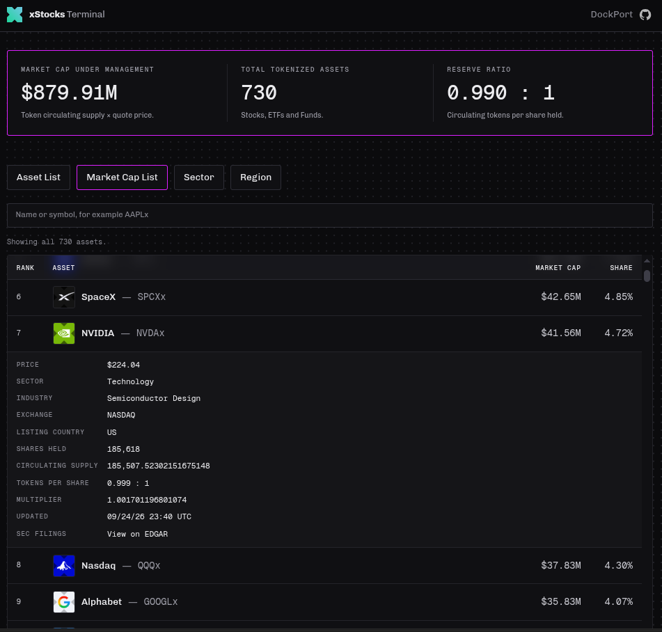

`Repo in early stages of development.`

`Not officially associated or partnered with xStocks. This Repo simply uses public API data.`

# xStocks Terminal

A web app that analyzes all xStocks tokenized assets.

## Stack
- Python scripting.
- Github actions.
- HTML, CSS, and JavaScript.
- Vercel.
- xStock API v2.
- BQ-MICS (Business Quant Multi-Industry Classification System)
- SEC EDGAR

## Preview 

