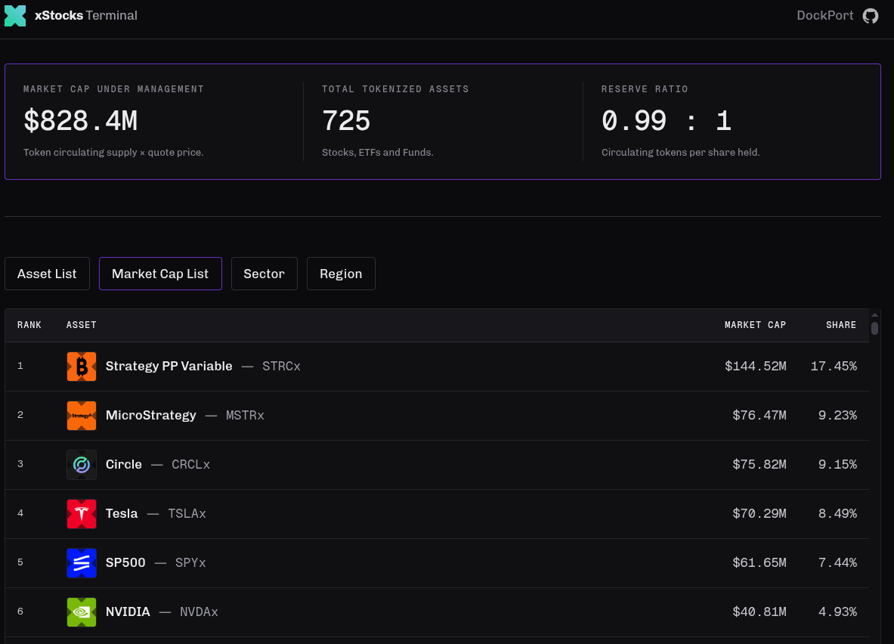

`Repo in early stages of development.`

# xStocks Terminal

A web app that analyzes all xStocks tokenized assets.

## Stack
- Python scripting.
- Github actions.
- HTML, CSS, and JavaScript.
- Vervel.
- xStock API v2.
- Business Quant API.

## Preview 

