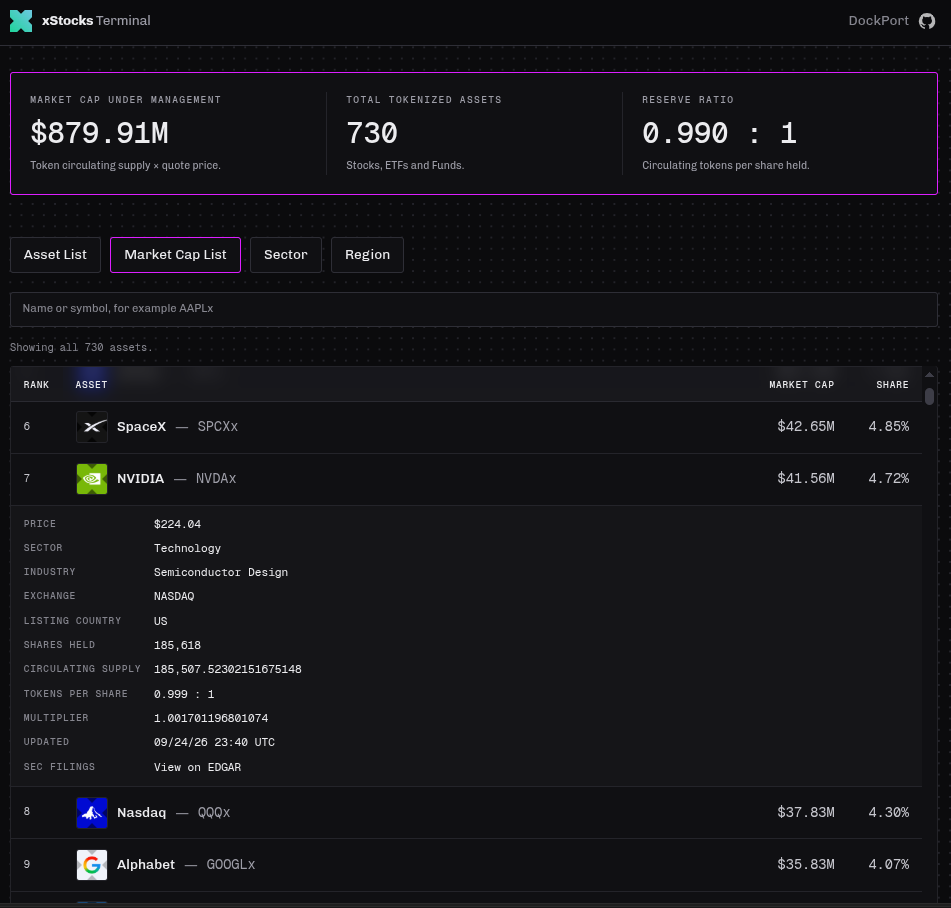

# xStocks Terminal

A web app that analyzes all xStocks tokenized assets.

Live deployment: https://xstocks-terminal.vercel.app/

`Not partnered with xStocks. This Repo simply uses public API data.`

## Stack
- Python scripting.
- Github actions.
- HTML, CSS, and JavaScript.
- Vercel.
- xStock API v2.
- Sector and Industry classifcation source https://businessquant.com/ 
- SEC EDGAR

## Preview 

